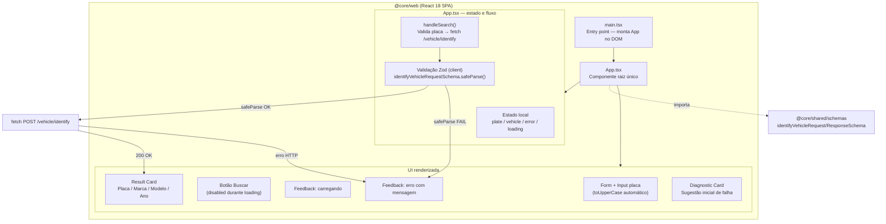
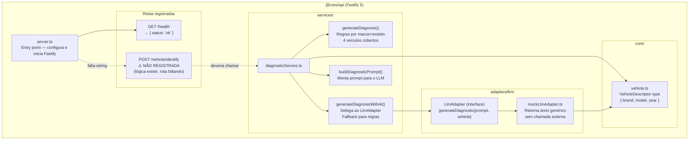
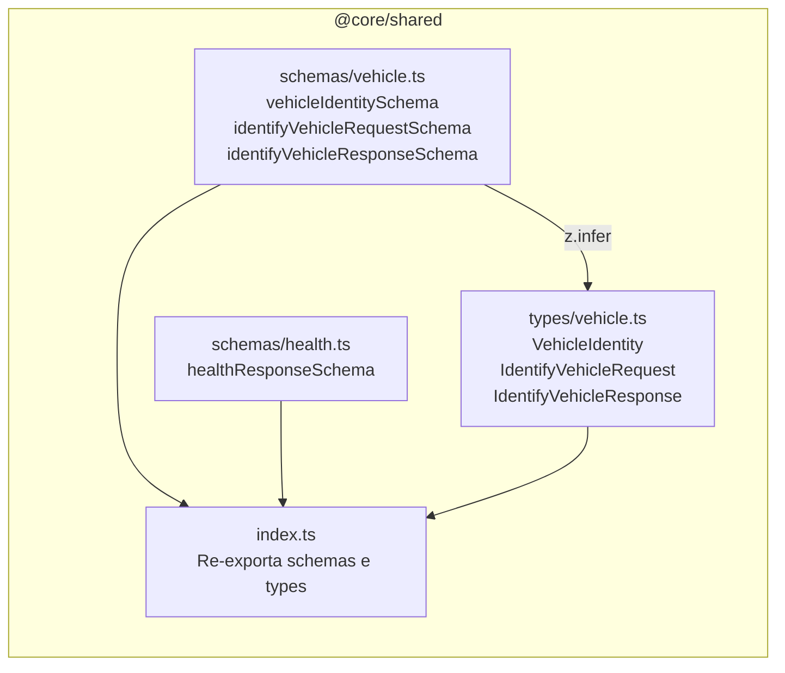

# C4 — Nível 3: Componentes

> Atualizado em 2026-05-03. Baseado em leitura direta dos arquivos-fonte.

---

## Frontend — `@core/web`



### Arquivos do Frontend

| Arquivo | Responsabilidade |
|---------|-----------------|
| `src/main.tsx` | Entry point — `ReactDOM.createRoot` + monta `<App />` |
| `src/App.tsx` | Componente raiz completo (estado + fetch + UI) |
| `src/index.css` | Estilos globais Tailwind |
| `src/vite-env.d.ts` | Declaração de tipos para `import.meta.env` |

---

## Backend — `@core/api`



### Arquivos do Backend

| Arquivo | Responsabilidade |
|---------|-----------------|
| `src/server.ts` | Inicializa Fastify, registra rotas, bind porta |
| `src/services/diagnosticService.ts` | Orquestra geração de diagnóstico (regras + IA) |
| `src/adapters/llm/mockLlmAdapter.ts` | Implementação mock do `LlmAdapter` |
| `src/core/vehicle.ts` | Tipo local `VehicleDescriptor` |

---

## Shared — `@core/shared`



### Schemas Zod (fonte de verdade)

| Schema | Valida | Regras |
|--------|--------|--------|
| `vehicleIdentitySchema` | shape interno do veículo | campos opcionais exceto brand/model |
| `identifyVehicleRequestSchema` | entrada do POST | placa 7-8 chars, regex ABC1234 ou ABC1D23 |
| `identifyVehicleResponseSchema` | resposta da API | plate, brand, model, year, diagnostic (todos obrigatórios) |

---

## Gap Crítico Identificado

```
Web chama:     POST /vehicle/identify
API registra:  GET /health    ← ÚNICA ROTA

DiagnosticService.generateDiagnosisWithAI() existe mas não está conectado ao server.ts.
O endpoint está quebrado em produção — retorna 404.
```

---

## Escala de Confiança

| Componente | Confiança |
|-----------|-----------|
| `main.tsx`, `App.tsx` | 🟢 CONFIRMADO — lido diretamente |
| `server.ts` rotas | 🟢 CONFIRMADO — apenas /health |
| `diagnosticService.ts` | 🟢 CONFIRMADO — lógica real implementada |
| `mockLlmAdapter.ts` | 🟢 CONFIRMADO — implementação real |
| `shared` schemas | 🟢 CONFIRMADO — Zod schemas validados |
| Rota `/vehicle/identify` | 🔴 LACUNA — existe no plano, ausente no código |

---
*Gerado pelo Reversa Architect em 2026-05-03*
