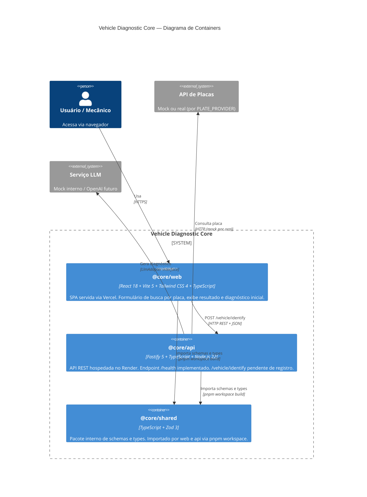

# C4 — Nível 2: Containers

> Atualizado em 2026-05-03. Baseado em código-fonte real.

## Detalhamento dos Containers

### `@core/web` — Frontend SPA
- **Runtime:** Navegador (browser)
- **Build:** `vite build` → `apps/web/dist/`
- **Deploy:** Vercel CDN global
- **Env:** `VITE_API_BASE_URL` (injetado no build)
- **Estado:** Componente único `App.tsx` — validação client-side via Zod antes de chamar a API

### `@core/api` — Backend REST
- **Runtime:** Node.js 22 gerenciado pelo Render.com
- **Framework:** Fastify 5 com ESM nativo
- **Build:** `tsc` → `apps/api/dist/`
- **Deploy:** Render.com free tier
- **Porta:** injetada via `process.env.PORT` (padrão local: 3000)
- **Rotas implementadas:**
  - `GET /health` → `{ status: "ok" }` 🟢
  - `POST /vehicle/identify` → **não registrado** 🔴

### `@core/shared` — Pacote Compartilhado
- **Tipo:** Pacote interno do monorepo
- **Publicação:** Nunca publicado no npm — acesso via `workspace:*`
- **Exports:**
  - `.` → `index.ts` (re-exporta tudo)
  - `./schemas` → schemas Zod
  - `./types` → TypeScript types

## Escala de Confiança

| Container | Confiança | Observação |
|-----------|-----------|-----------|
| @core/web | 🟢 CONFIRMADO | App.tsx funcional, build configurado |
| @core/api | 🟡 PARCIAL | Server funciona, rota principal ausente |
| @core/shared | 🟢 CONFIRMADO | Schemas e types completos para o MVP |
| API de Placas real | 🔴 LACUNA | Factory de provider não implementada |
| LLM real | 🔴 LACUNA | Adapter mock, sem integração externa |

---
*Gerado pelo Reversa Architect em 2026-05-03*
