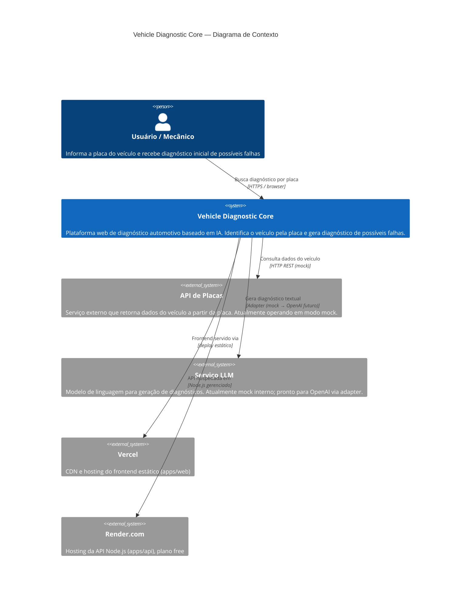

# C4 — Nível 1: Contexto

> Atualizado em 2026-05-03. Baseado em código-fonte real.

## Escala de Confiança

| Elemento | Confiança | Fonte |
|----------|-----------|-------|
| Usuário / Mecânico | 🟢 CONFIRMADO | App.tsx — formulário de busca por placa |
| Vehicle Diagnostic Core | 🟢 CONFIRMADO | Repositório real, monorepo pnpm |
| API de Placas (mock) | 🟢 CONFIRMADO | render.yaml `PLATE_PROVIDER=mock`, DEPLOY.md |
| Serviço LLM (mock) | 🟢 CONFIRMADO | mockLlmAdapter.ts existe e é usado |
| Vercel (web deploy) | 🟢 CONFIRMADO | vercel.json + DEPLOY.md |
| Render.com (api deploy) | 🟢 CONFIRMADO | render.yaml |
| Integração LLM real | 🔴 LACUNA | `OPENAI_API_KEY` declarado, sem uso |
| Integração Placas real | 🔴 LACUNA | `PLATE_PROVIDER` declarado, factory não implementada |

---
*Gerado pelo Reversa Architect em 2026-05-03*
