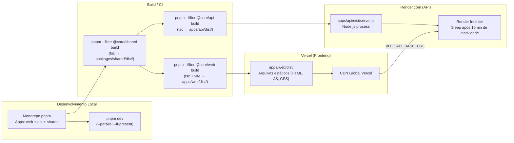

# Deployment — Vehicle Diagnostic Core

> Gerado em 2026-05-03 pelo Reversa Architect.  
> Fonte: `render.yaml`, `vercel.json`, `DEPLOY.md`, `pnpm-workspace.yaml`.

---

## Visão Geral

O sistema usa um modelo de **deploy split**: frontend estático no Vercel, API Node.js no Render.com.



---

## Frontend — Vercel

| Parâmetro | Valor |
|-----------|-------|
| Arquivo de config | `vercel.json` |
| Install command | `pnpm install --no-frozen-lockfile` |
| Build command | `pnpm --filter @core/shared build && pnpm --filter @core/web build` |
| Output directory | `apps/web/dist` |
| Framework detection | Não necessário (output manual) |

### Variáveis de Ambiente (Vercel)
| Variável | Valor esperado | Obrigatória |
|----------|----------------|------------|
| `VITE_API_BASE_URL` | `https://<nome-do-servico>.onrender.com` | Sim |

> ⚠️ `VITE_API_BASE_URL` é injetada em tempo de **build**, não de runtime. Mudanças exigem rebuild.

---

## API — Render.com

| Parâmetro | Valor |
|-----------|-------|
| Arquivo de config | `render.yaml` |
| Tipo de serviço | `web` (Node.js) |
| Plano | `free` |
| Build command | `pnpm install --no-frozen-lockfile && pnpm --filter @core/shared build && pnpm --filter @core/api build` |
| Start command | `pnpm --filter @core/api start` |
| Entry point em produção | `apps/api/dist/server.js` |

### Variáveis de Ambiente (Render)
| Variável | Valor default | Status |
|----------|--------------|--------|
| `NODE_ENV` | `production` | 🟢 Configurada |
| `PORT` | injetada pelo Render | 🟢 Consumida no código |
| `CORS_ORIGIN` | `sync: false` (manual) | 🟡 Declarada, **não consumida no código** |
| `PLATE_PROVIDER` | `mock` | 🟡 Declarada, **não consumida no código** |
| `OPENAI_API_KEY` | `sync: false` (manual) | 🔴 Não usada ainda |
| `DATABASE_URL` | `sync: false` (manual) | 🔴 Sem banco implementado |
| `JWT_SECRET` | `sync: false` (manual) | 🔴 Sem auth implementada |
| `JWT_REFRESH_SECRET` | `sync: false` (manual) | 🔴 Sem auth implementada |

> ⚠️ **Plano free do Render:** o serviço dorme após ~15 minutos de inatividade. O primeiro request após sleep pode levar 30-60 segundos (cold start). Relevante para UX em produção.

---

## Ordem de Build (Dependência)

```
1. pnpm install (raiz do monorepo)
2. @core/shared build   ← OBRIGATÓRIO PRIMEIRO (web e api dependem)
3. @core/web build      ← Depende de shared
   @core/api build      ← Depende de shared (pode ser paralelo com web)
```

Não há Dockerfile nem docker-compose. Deploy é gerenciado pelas plataformas (Vercel + Render) via configuração declarativa.

---

## Ambiente Local

```bash
# Instalar dependências
pnpm install

# Rodar web + api em paralelo
pnpm dev

# Web acessível em:  http://localhost:5173
# API acessível em:  http://localhost:3000

# Variável necessária no .env da web (desenvolvimento):
# VITE_API_BASE_URL=http://localhost:3000
```

---

## Riscos de Deploy Identificados

| Risco | Severidade | Detalhe |
|-------|-----------|---------|
| Rota `/vehicle/identify` ausente | 🔴 CRÍTICO | App está em produção mas a rota principal retorna 404 |
| Cold start no Render free | 🟡 Médio | Latência perceptível após inatividade |
| `VITE_API_BASE_URL` hardcoded no build | 🟡 Médio | Troca de URL da API exige rebuild do frontend |
| `CORS_ORIGIN` não aplicado | 🟡 Médio | Sem restrição de origem na API atual |
| Sem health check HTTP configurado no Render | 🟢 Baixo | `/health` existe, mas não está configurado como probe no render.yaml |

---

## Escala de Confiança

| Elemento | Confiança | Fonte |
|----------|-----------|-------|
| Vercel config | 🟢 CONFIRMADO | `vercel.json` + `DEPLOY.md` |
| Render config | 🟢 CONFIRMADO | `render.yaml` + `DEPLOY.md` |
| Ordem de build shared→web/api | 🟢 CONFIRMADO | scripts em `package.json` raiz |
| Cold start Render free | 🟡 INFERIDO | Comportamento documentado da plataforma |
| CORS / PLATE_PROVIDER em runtime | 🔴 LACUNA | Env vars declaradas mas não consumidas |

---
*Gerado pelo Reversa Architect em 2026-05-03*
