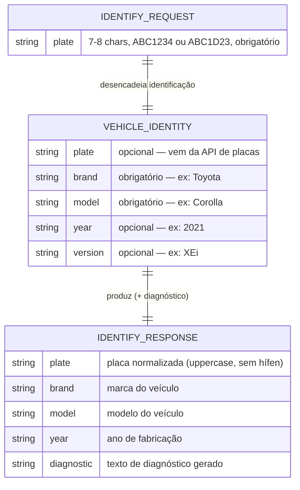
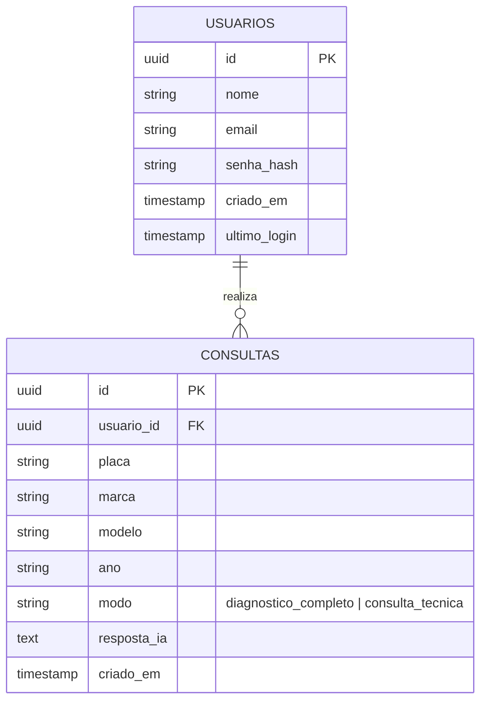

# ERD — Vehicle Diagnostic Core

> Atualizado em 2026-05-03 pelo Reversa Architect.  
> **IMPORTANTE:** Nenhum banco de dados está implementado. Este ERD deriva exclusivamente dos Zod schemas em `@core/shared` e da lógica do `diagnosticService.ts`.

---

## Schemas Implementados (fonte: `@core/shared`)

---

## Entidades Planejadas (não implementadas)

> 🔴 LACUNA: Nenhuma tabela de banco de dados existe. As entidades abaixo derivam do `implementation_plan.md` e das variáveis de ambiente declaradas (`DATABASE_URL`, `JWT_SECRET`).

---

## Observações

### O que existe no código
- Schemas Zod em `@core/shared/schemas/vehicle.ts` definem o contrato da API (request/response)
- Tipo `VehicleDescriptor { brand, model, year }` em `apps/api/src/core/vehicle.ts`
- **Nenhuma migration, ORM ou conexão de banco** identificada

### O que está planejado mas ausente
- `DATABASE_URL` declarada no `render.yaml` mas sem uso no código
- `JWT_SECRET` / `JWT_REFRESH_SECRET` declarados, sem middleware de auth
- Prisma mencionado em análise prévia, mas **sem `schema.prisma` ou pacote instalado**

### Lacunas que requerem decisão
1. **Tecnologia de DB:** PostgreSQL? SQLite para começar? MongoDB? (nada definido)
2. **ORM:** Prisma era cogitado, mas não está no `package.json`
3. **Persistência de histórico:** necessária para o chat de diagnóstico planejado

---

## Escala de Confiança

| Elemento | Confiança | Fonte |
|----------|-----------|-------|
| `IDENTIFY_REQUEST` schema | 🟢 CONFIRMADO | `schemas/vehicle.ts` linha 11-23 |
| `IDENTIFY_RESPONSE` schema | 🟢 CONFIRMADO | `schemas/vehicle.ts` linha 25-31 |
| `VEHICLE_IDENTITY` schema | 🟢 CONFIRMADO | `schemas/vehicle.ts` linha 3-9 |
| Entidades USUARIOS/CONSULTAS | 🔴 LACUNA | Inferido de `implementation_plan.md` e env vars |
| Banco de dados real | 🔴 LACUNA | `DATABASE_URL` declarada, sem implementação |

---
*Gerado pelo Reversa Architect em 2026-05-03*
